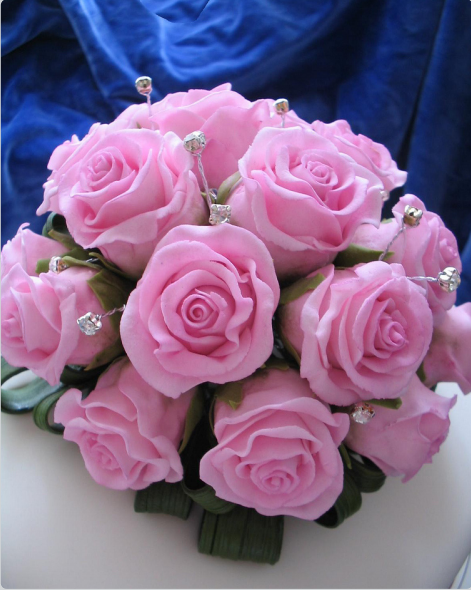
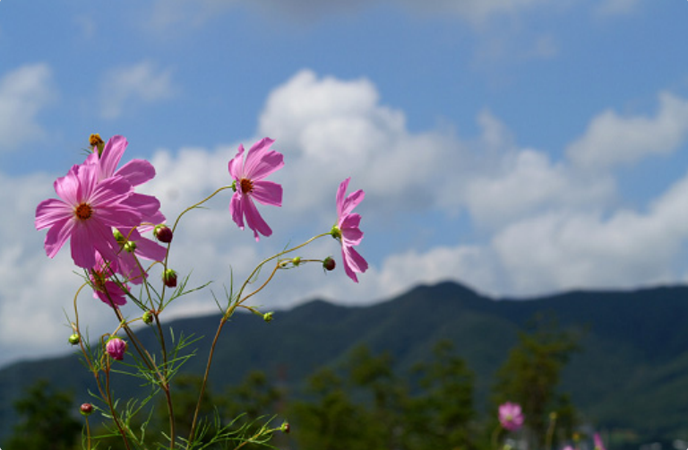

# Pencil-Drawing-Scala
Implementation of paper "Combining Sketch and Tone for Pencil Drawing Production"[1,2] in Scala (a little Python) based on the Matlab version: https://github.com/fumin/pencil

May be 10x ~100x slower than the matlab code, depends on the input image size.

The bottleneck is in the python part, needs to solve that in the fufure.

Another Matlab implementation with better performance: https://github.com/candycat1992/PencilDrawing

## Building

Tested on Ubuntu 14.04

* sbt 0.13
* SciPy

## Running

change the input image, output name and so on:

```bash
IMG_PATH=$ROOT/images/img/flower.png
OUT_PATH=$ROOT/images/pencil_result.jpg
TEXTURE_IMG_PATH=$ROOT/images/textures/texture.jpg

# set to 0 generates the pencil drawing, 
# set to 1 generates the colourful pencil drawing
IS_DRAW_COLOR=1

# set to 1 will output the middle results
# set to 0 just output the final result
IS_SHOW_STEP=1
```

Then have fun!.

## Some results







## License
MIT

## Reference
[1] http://lxu.me/mypapers/NPAR12_PENCIL.pdf

[2] http://www.cse.cuhk.edu.hk/leojia/projects/pencilsketch/npar12_pencil.pdf
