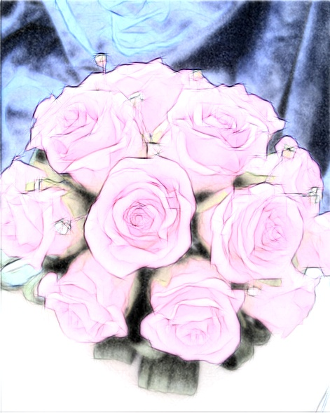
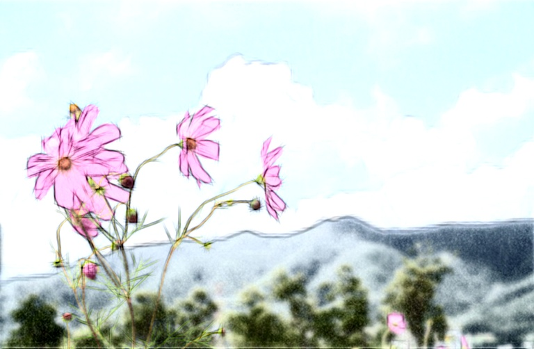
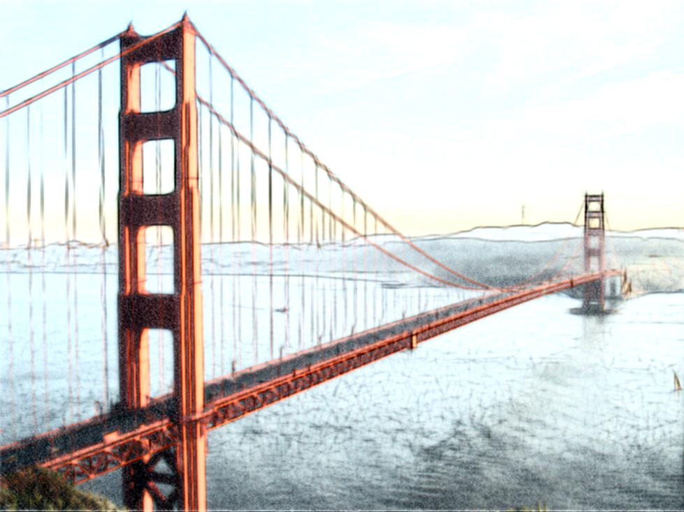

# Pencil-Drawing-Scala
Implementation of paper "http://www.cse.cuhk.edu.hk/leojia/projects/pencilsketch/npar12_pencil.pdf"[1] 
in Scala (a little Python)

based on the Matlab version: https://github.com/fumin/pencil

found another project with better performance: https://github.com/candycat1992/PencilDrawing

May be 10x ~100x slower than the matlab code, depends on the input image size.

The bottleneck is in the python part, needs to solve that in the fufure.
 

## Building

Tested on Ubuntu 14.04

* sbt 0.13
* opencv 3.0
* SciPy

You should build opencv 3.0 from source and remenber to build the jar file:
http://docs.opencv.org/2.4/doc/tutorials/introduction/desktop_java/java_dev_intro.html

## Running

After compiling the project, one thing left is to modify  following lines in the run_script.sh script :

```bash

# better to copy your opencv-300.jar to replace this one
OPENCV_JAR_FILE=$ROOT/lib/opencv-300.jar

# needs to set to your opencv-3.0 build lib path 
LIBRARY_PATH=$HOME/opencv3.0/opencv-3.0.0/build/lib/

```

change the input image, output name and so on:

```bash
IMG_PATH=$ROOT/images/img/flower.png
OUT_PATH=$ROOT/images/pencil_result.jpg
TEXTURE_IMG_PATH=$ROOT/images/textures/texture.jpg

# set to 0 generates the pencil drawing, 
# set to 1 generates the colourful pencil drawing
IS_DRAW_COLOR=1

# set to 1 will output the middle results
# set to 0 just output the final result
IS_SHOW_STEP=1
```

Then have fun!.

## Some results







## Reference
[1] http://lxu.me/mypapers/NPAR12_PENCIL.pdf
